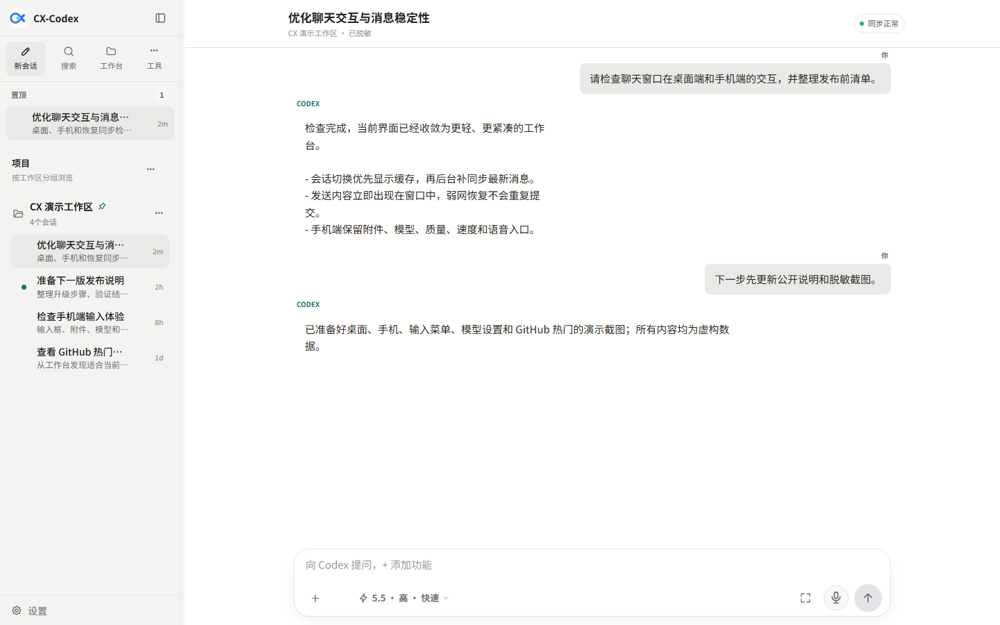
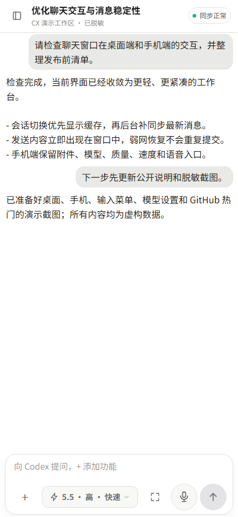
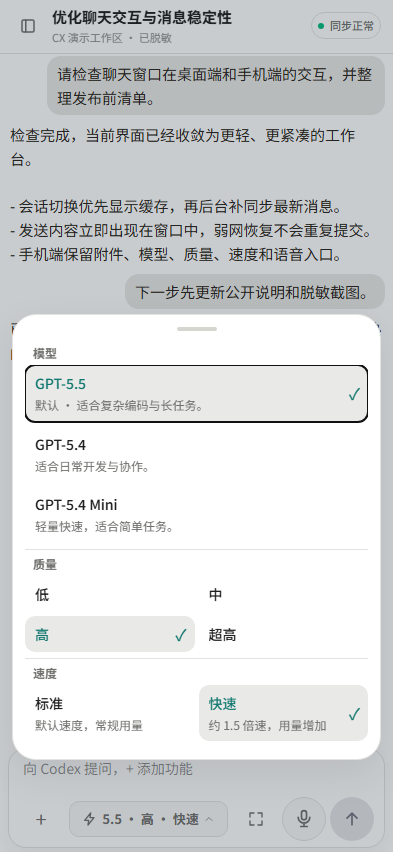
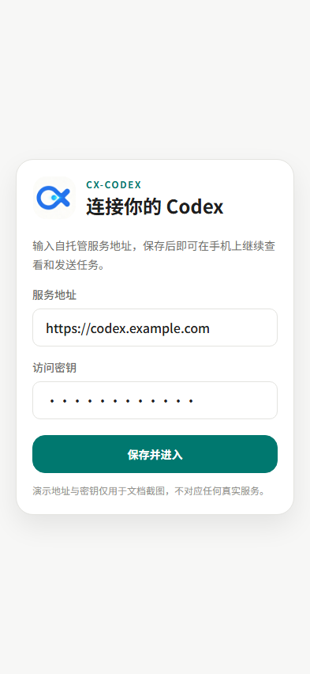
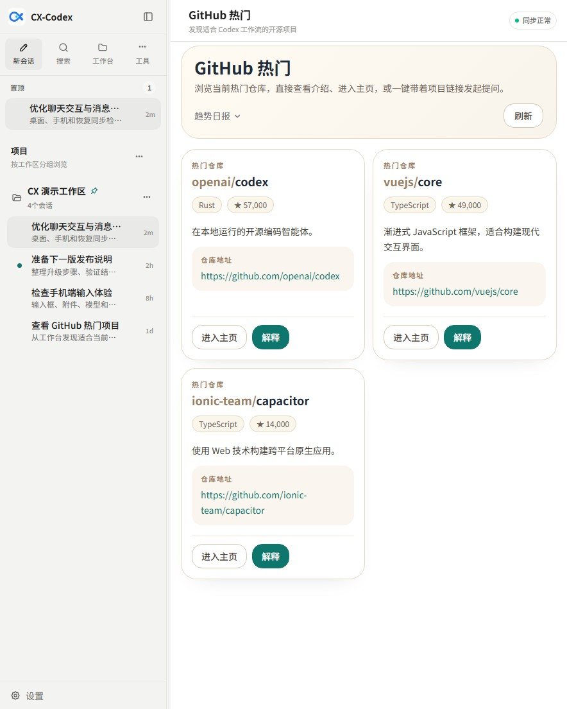
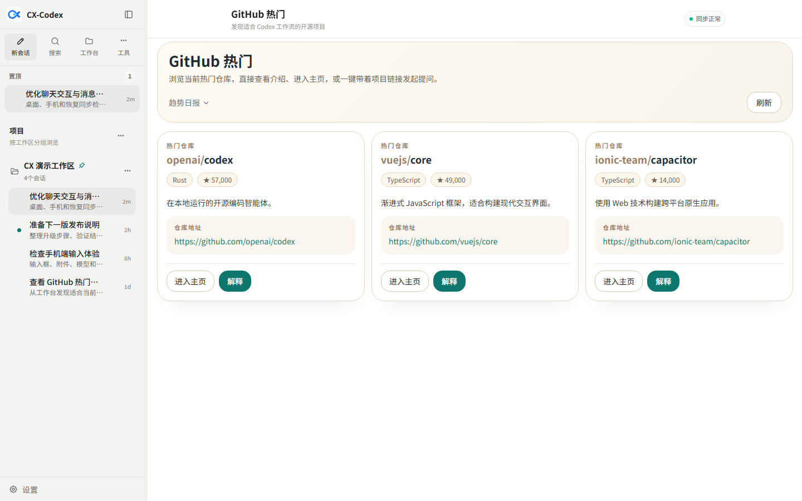

# CX-Codex

[](https://github.com/Qjzn/CX-Codex/releases/latest)
[](https://github.com/Qjzn/CX-Codex/actions/workflows/release.yml)
[](./LICENSE)
[](https://github.com/Qjzn/CX-Codex/releases/latest)
[](#快速安装)

Self-hosted OpenAI Codex Web UI and Android client bridge.

把本机 Codex 变成可从浏览器、手机和远程入口访问的稳定工作台。重点面向 Windows / Windows Server、Android、局域网、自托管远程访问和长期日常使用。

> 截图由当前前端组件在专用演示路由中渲染，工作区、会话、地址和密钥均为虚构数据，不包含真实账号、个人路径、公网入口或私人对话。



## 快速入口

- 最新 Release: [github.com/Qjzn/CX-Codex/releases/latest](https://github.com/Qjzn/CX-Codex/releases/latest)
- 2.7.5 发布说明: [docs/release-notes-2.7.5.zh-CN.md](./docs/release-notes-2.7.5.zh-CN.md)
- 2.7.4 发布说明（已由 2.7.5 替代）: [docs/release-notes-2.7.4.zh-CN.md](./docs/release-notes-2.7.4.zh-CN.md)
- 2.7.3 发布说明（已由 2.7.4 替代）: [docs/release-notes-2.7.3.zh-CN.md](./docs/release-notes-2.7.3.zh-CN.md)
- 2.7.2 发布说明: [docs/release-notes-2.7.2.zh-CN.md](./docs/release-notes-2.7.2.zh-CN.md)
- 2.6.0 发布说明: [docs/release-notes-2.6.0.zh-CN.md](./docs/release-notes-2.6.0.zh-CN.md)
- 2.5.9 发布说明: [docs/release-notes-2.5.9.zh-CN.md](./docs/release-notes-2.5.9.zh-CN.md)
- 2.5.8 发布说明: [docs/release-notes-2.5.8.zh-CN.md](./docs/release-notes-2.5.8.zh-CN.md)
- 2.5.7 发布说明: [docs/release-notes-2.5.7.zh-CN.md](./docs/release-notes-2.5.7.zh-CN.md)
- 2.5.6 发布说明: [docs/release-notes-2.5.6.zh-CN.md](./docs/release-notes-2.5.6.zh-CN.md)
- 2.5.5 发布说明: [docs/release-notes-2.5.5.zh-CN.md](./docs/release-notes-2.5.5.zh-CN.md)
- 2.5.4 发布说明: [docs/release-notes-2.5.4.zh-CN.md](./docs/release-notes-2.5.4.zh-CN.md)
- 2.5.3 发布说明: [docs/release-notes-2.5.3.zh-CN.md](./docs/release-notes-2.5.3.zh-CN.md)
- 2.5.2 发布说明: [docs/release-notes-2.5.2.zh-CN.md](./docs/release-notes-2.5.2.zh-CN.md)
- 2.5.1 发布说明: [docs/release-notes-2.5.1.zh-CN.md](./docs/release-notes-2.5.1.zh-CN.md)
- 2.5.0 发布说明: [docs/release-notes-2.5.0.zh-CN.md](./docs/release-notes-2.5.0.zh-CN.md)
- 2.4.1 发布说明: [docs/release-notes-2.4.1.zh-CN.md](./docs/release-notes-2.4.1.zh-CN.md)
- 2.4.0 发布说明: [docs/release-notes-2.4.0.zh-CN.md](./docs/release-notes-2.4.0.zh-CN.md)
- 2.3.1 发布说明: [docs/release-notes-2.3.1.zh-CN.md](./docs/release-notes-2.3.1.zh-CN.md)
- 2.3.0 发布说明: [docs/release-notes-2.3.0.zh-CN.md](./docs/release-notes-2.3.0.zh-CN.md)
- Windows 一条命令安装: [快速安装](#快速安装)
- Android 客户端说明: [docs/android-shell.zh-CN.md](./docs/android-shell.zh-CN.md)
- 平台兼容与 Slash Command 支持: [docs/platform-and-commands.zh-CN.md](./docs/platform-and-commands.zh-CN.md)
- Codex App Server 协议兼容: [docs/protocol-compatibility.zh-CN.md](./docs/protocol-compatibility.zh-CN.md)
- 协议能力矩阵: [docs/app-server-protocol-matrix.zh-CN.md](./docs/app-server-protocol-matrix.zh-CN.md)
- OpenAI 官方文档审查: [docs/openai-docs-review.zh-CN.md](./docs/openai-docs-review.zh-CN.md)
- Release readiness 审计: [docs/release-readiness-audit.zh-CN.md](./docs/release-readiness-audit.zh-CN.md)
- Candidate release 审查: [docs/candidate-release-review.zh-CN.md](./docs/candidate-release-review.zh-CN.md)
- Candidate PR review pack: [docs/candidate-pr-review-pack.zh-CN.md](./docs/candidate-pr-review-pack.zh-CN.md)
- Desktop parity UI 规划: [docs/desktop-parity-ui-plan.zh-CN.md](./docs/desktop-parity-ui-plan.zh-CN.md)
- 前端 UI 整改方案: [docs/frontend-ui-remediation-plan.zh-CN.md](./docs/frontend-ui-remediation-plan.zh-CN.md)
- 本地完整回归测试清单: [docs/local-regression-checklist.zh-CN.md](./docs/local-regression-checklist.zh-CN.md)
- 远程访问方案: [docs/cloudflare-tunnel.zh-CN.md](./docs/cloudflare-tunnel.zh-CN.md)
- 安全硬化清单: [docs/security-hardening.zh-CN.md](./docs/security-hardening.zh-CN.md)
- 问题反馈前排查: [SUPPORT.md](./SUPPORT.md)

## 为什么用它

- 原生 Codex 仍在本机运行，`CX-Codex` 只负责把浏览器、手机和远程访问链路做稳。
- 重点解决 Windows 常驻、Android 恢复、长会话状态和远程入口这几类高频真实问题。
- 默认不内置私人服务器地址，不要求上传私有项目、Token 或账号凭据。
- Release 自动产出 Web 包、校验文件和使用固定官方证书签名的 Android APK。

## 核心卖点

- 本机 Codex 浏览器入口：复用本机 Codex、项目目录和登录态，不重建复杂云端账号体系。
- Android / 手机友好：支持移动端连接地址持久化、密钥持久化、无感重登、前台恢复补同步。
- CX 电子宠物浮窗：在其他 App 上层查看真实任务进展、快速进入最近会话或直接回复；待命自动缩成小气泡，完成记录读后再清理。
- 状态更可靠：减少任务结束后仍显示“思考中”、任务执行中无状态、线程切换慢和移动端恢复卡顿。
- Windows 友好部署：提供 Windows bootstrap、固定端口、服务脚本、发布包和常见排障文档。
- 自托管远程访问：可用于局域网、VPN、Tailscale、frp、Nginx、Caddy 或 Cloudflare Tunnel。
- 面向开源传播：README、Release、Topics、Issue 模板和截图围绕“Codex Web UI / Android / self-hosted / Windows”统一表达，方便 GitHub 和 AI 检索。

## 适合谁

- 想在电脑上跑 Codex，同时用手机继续查看和发送任务的人。
- 想在 Windows Server 上常驻一个 Codex Web 入口的人。
- 想把本地 Codex 通过局域网、VPN 或自托管公网入口安全访问的人。
- 想要一个轻量、可维护、开源的 Codex browser bridge，而不是重型 SaaS 平台的人。

## 当前界面

以下图片直接复用项目里的侧栏、消息、输入区和 GitHub 热门组件，仅替换为可公开的演示数据。

桌面端采用紧凑双栏工作台，会话、状态和输入区保持在同一任务上下文中：


手机端改为单栏阅读，保留同步状态、完整消息流和底部输入区：



附件、文件夹、拍照、一次性计划、本轮要求、插件和技能集中在 `+` 菜单：


模型、质量和速度使用同一个移动端设置面板：



Android 首次连接只需要自托管地址和访问密钥；图中的域名与密钥均为演示值：



折叠屏 / 平板保留双栏浏览，并可直接查看 GitHub 热门项目：



桌面端 GitHub 热门模块：



## 快速安装

Windows bootstrap 会复用匹配的 Node.js `22.13.0+` 与 npm `9+`；当本机版本过旧或 Node/npm 错配时，会校验 Node.js 官方 SHA-256 后在安装目录内使用便携式 LTS 运行时，不切换系统全局 Node 版本。
默认从 GitHub 最新正式 Release 下载，并校验配套 SHA-256；更新使用临时目录切换，失败时保留或恢复上一版本。

Windows 一条命令：

```powershell
Set-ExecutionPolicy Bypass -Scope Process -Force; irm https://raw.githubusercontent.com/Qjzn/CX-Codex/main/scripts/bootstrap-windows.ps1 | iex
```

安装脚本会自动完成：

- 安装或复用 Node.js
- 下载并构建项目
- 生成默认配置
- 创建启动脚本
- 尝试放通端口
- 启动 Codex Web 服务

默认本地访问：

```text
http://127.0.0.1:7420
```

## 一句话安装并开启手机访问

把下面的提示词交给目标 Windows 机器上的 Codex：

```text
打开并检查 https://github.com/Qjzn/CX-Codex 这个仓库。
请只运行项目官方 Windows bootstrap，并使用 -RemoteQuick -JsonOutput。
安装到当前用户目录，保持 127.0.0.1:7420、已有访问密码和 SHA-256 校验；
公网访问优先恢复 Tailscale 固定地址，未安装或未登录时才使用 Cloudflare 临时备用地址；
不要修改防火墙、hosts、系统 DNS，不要关闭鉴权，也不要输出密码、Cookie 或 Token。
完成后只返回 JSON 中的 publicUrl、pairingUrl、停止方式和非敏感错误。
如果公网健康、未登录 API 401 或 WebSocket 鉴权任一验证失败，不要声称安装完成。
直接执行，不要只给步骤。
```

官方执行入口：

```powershell
& ([scriptblock]::Create((irm 'https://raw.githubusercontent.com/Qjzn/CX-Codex/main/scripts/bootstrap-windows.ps1'))) -RemoteQuick -JsonOutput
```

默认安装最新正式 Release，并校验 Release 包的 SHA-256；只有参与源码预览时才应显式使用 `-UseBranchArchive`。

首次安装通常需要 2–5 分钟。bootstrap 会持续显示安装阶段，并在长步骤中每 15 秒提示仍在运行；不要在构建期间关闭窗口。cloudflared 大文件下载遇到瞬时断线时会自动重试，失败或重试前会清理未完成的半包。

安装和公网验证全部完成后，bootstrap 会自动打开电脑本机的 `http://127.0.0.1:7420/local-setup`，并在桌面和开始菜单创建“CX-Codex 管理中心”。这里会持续显示本机、局域网和当前外网地址，也可查看、生成或修改访问密码。升级和重复安装会保留原密码、远程访问模式及未知配置字段；只有首次安装或用户手动修改时密码才变化。用手机扫描二维码打开外网地址，再输入页面显示的密码即可；二维码只在本机生成且只包含地址，管理中心也不允许通过公网域名访问。无人值守安装可增加 `-SkipOpenPairing`，完成后再从快捷方式打开管理中心。

`-JsonOutput` 的 stdout 固定为单行 JSON，构建进度和诊断写入 stderr。成功结果包含 `schemaVersion`、`operation`、`version`、`started`、`healthReady`、本机/公网地址和结构化告警；失败结果返回 `BOOTSTRAP_FAILED` 与失败阶段，不输出密码、Cookie 或 Token。bootstrap 还会读取归档内的 `release-capabilities.json`，拒绝把新版参数交给不支持它们的旧 Release。

## 卸载或彻底清理

官方卸载命令：

```powershell
& ([scriptblock]::Create((irm 'https://raw.githubusercontent.com/Qjzn/CX-Codex/main/scripts/uninstall-windows.ps1')))
```

默认会停止 CX-Codex 与对应快速隧道，删除程序目录、启动器、管理中心快捷方式、计划任务和对应防火墙规则；保留 `%USERPROFILE%\.cx-codex` 中的配置/日志/运行数据，也不会删除 `%USERPROFILE%\.codex` 登录态、用户工作区或 Android 签名材料。

确认不再需要 CX-Codex 运行数据和项目托管的 cloudflared 时，才执行：

```powershell
& ([scriptblock]::Create((irm 'https://raw.githubusercontent.com/Qjzn/CX-Codex/main/scripts/uninstall-windows.ps1'))) -RemoveUserData -RemoveCloudflared
```

两种模式都支持 `-JsonOutput`，便于安装器或自动化读取结果。

## Android 客户端

`CX-Codex` Android 壳用于连接你自己的 Codex Web 服务。

设计原则：

- APK 默认不内置任何私人服务器地址。
- 首次启动先输入连接地址，并永久保存到设备本地。
- 输入访问密钥后永久保存，Cookie 或 token 失效时自动重登。
- App 切后台或锁屏后恢复，会主动补同步线程状态和最新消息。
- App 内链接可通过原生桥接打开。
- 本地文档支持在 App 内预览或交给系统应用打开，包括 Markdown、PDF、DOCX、文本和图片。

Release 页面会发布 Android APK：

- 正式 Release 只发布 `cx-codex-android-<version>.apk`，并始终使用同一张官方签名证书。
- GitHub 仓库缺少签名配置或证书指纹变化时，发布工作流会直接失败，不会生成可能导致覆盖安装失败的公开 Debug APK。
- 本地 Debug 构建使用独立包名 `com.cxcodex.bridge.debug`，可与正式版同时安装。

如果你自己构建，请查看：

- [docs/android-shell.zh-CN.md](./docs/android-shell.zh-CN.md)

## 源码手动运行

需要 Node.js `22.13.0+` 和 npm。当前可验证的发布入口是 GitHub 源码与 Release；npm 包尚未发布，因此不把 `npx` 作为安装承诺。

```bash
git clone https://github.com/Qjzn/CX-Codex.git
cd CX-Codex
npm ci
npm run build
node dist-cli/index.js
```

固定到 `7420`：

```powershell
node dist-cli/index.js --host 0.0.0.0 --port 7420 --no-tunnel --password "change-me"
```

配置文件优先级：

1. `--config <path>`
2. `CX_CODEX_CONFIG`
3. `./cx-codex.config.json`
4. `~/.cx-codex/config.json`

示例配置：

```json
{
  "host": "0.0.0.0",
  "port": 7420,
  "password": "replace-with-your-password",
  "tunnel": false,
  "open": false,
  "projectPath": "C:\\Users\\your-user\\Documents\\Playground"
}
```

运行库会保留有限的恢复事件。若长期运行后 `~/.cx-codex/runtime.sqlite` 明显膨胀，可先停止 CX-Codex，再执行：

```bash
cx-codex runtime-compact
```

命令会在仍有未收敛任务时拒绝压缩；正常完成后会输出压缩前后体积和回收空间。完整 `VACUUM` 不会自动占用正常启动时间。

语音转写可选配置：

- `CX_CODEX_OPENAI_API_KEY`、`CODEXUI_OPENAI_API_KEY` 或 `OPENAI_API_KEY`：配置后语音转写优先走 OpenAI 官方音频转写 API。
- `CX_CODEX_OPENAI_TRANSCRIBE_MODEL`、`CODEXUI_OPENAI_TRANSCRIBE_MODEL` 或 `OPENAI_TRANSCRIBE_MODEL`：可覆盖默认转写模型，默认 `gpt-4o-transcribe`；如配置 `gpt-4o-transcribe-diarize`，服务端会按官方要求改用 `response_format=diarized_json` 并补齐 `chunking_strategy=auto`。
- `CX_CODEX_OPENAI_TRANSCRIBE_MAX_BYTES`、`CODEXUI_OPENAI_TRANSCRIBE_MAX_BYTES` 或 `OPENAI_TRANSCRIBE_MAX_BYTES`：可覆盖转写上传请求体上限，默认按官方 25 MB 文件限制收紧为 `25000000` bytes。
- `CX_CODEX_OPENAI_TRANSCRIBE_URL`、`CODEXUI_OPENAI_TRANSCRIBE_URL` 或 `OPENAI_TRANSCRIBE_URL`：可配置兼容 OpenAI `/v1/audio/transcriptions` 的 HTTP(S) endpoint；非法或非 HTTP(S) URL 会回退官方默认 endpoint。
- 官方 API 链路会由服务端规范化 multipart `model`、`response_format` 和 diarize-only 的 `chunking_strategy`，避免客户端字段把 `gpt-4o-transcribe` / `gpt-4o-mini-transcribe` / `gpt-4o-transcribe-diarize` 带到不支持的响应格式。
- 诊断页会显示当前转写 provider、模型、上传上限、endpoint 主机/路径和 endpoint 配置/有效性布尔值，但不会显示 API key、Authorization、URL query 或原始非法 URL。
- `CX_CODEX_JSON_BODY_MAX_BYTES` 或 `JSON_BODY_MAX_BYTES`：可覆盖普通 JSON API 请求体上限，默认 2MiB。
- `CX_CODEX_FILE_UPLOAD_MAX_BYTES` 或 `FILE_UPLOAD_MAX_BYTES`：可覆盖普通文件上传请求体上限，默认 50MiB。
- 未配置 API key 时，语音转写仍会回退到现有 Codex / ChatGPT 登录态代理链路。

App Server 权限策略可选配置：

- `CX_CODEX_APP_SERVER_APPROVAL_POLICY` 或 `CODEXUI_APP_SERVER_APPROVAL_POLICY`：可选 `untrusted`、`on-request`、`never`，默认保留 legacy `never`。
- `CX_CODEX_APP_SERVER_SANDBOX_MODE` 或 `CODEXUI_APP_SERVER_SANDBOX_MODE`：可选 `read-only`、`workspace-write`、`danger-full-access`，默认保留 legacy `danger-full-access`。
- 更保守的本机策略可设置为 `CX_CODEX_APP_SERVER_APPROVAL_POLICY=on-request` 和 `CX_CODEX_APP_SERVER_SANDBOX_MODE=workspace-write`；非法值会回退到默认 legacy 策略。

## 远程访问

默认策略是“固定优先、临时兜底”：

- 局域网：直接访问服务器 IP 和端口。
- 固定公网：Tailscale Funnel。首次需要安装并登录 Tailscale，之后设备域名保持不变；CX-Codex 使用独立的 HTTPS `8443` 端口，后台 Funnel 会在 Tailscale 或电脑重启后恢复。
- 自有公网：Nginx / Caddy / frp。
- 临时公网：Cloudflare Quick Tunnel，无需账号或域名，但地址会变化。

Windows 安全一键入口（保留 `RemoteQuick` 参数名以兼容旧版本；新版本会先尝试固定地址）：

```powershell
& ([scriptblock]::Create((irm 'https://raw.githubusercontent.com/Qjzn/CX-Codex/main/scripts/bootstrap-windows.ps1'))) -RemoteQuick -JsonOutput
```

也可以在 Web 设置的“手机访问”中安装/检查 Tailscale、启用固定地址，或先使用临时备用地址。Tailscale Funnel 需要一次登录；Quick Tunnel 无需账号或域名，但地址会变化、无 SLA 且不支持 SSE。两种模式都会验证公网健康、访问密码和 WebSocket 鉴权。详细步骤与故障排查请看：

- [docs/cloudflare-tunnel.zh-CN.md](./docs/cloudflare-tunnel.zh-CN.md)

## 功能清单

- Codex Web UI browser bridge
- Android CX-Codex client shell
- 移动端恢复补同步
- 线程列表、会话内容、执行状态和停止状态展示
- 消息收藏、置顶、复制和跳转
- 本地文件链接、图片 / Markdown / PDF / DOCX 预览
- GitHub 热门项目模块
- MCP / 工具权限状态、审批边界和只读诊断
- 模型、推理档位、已连接插件与一次性计划 / 本轮要求操作栏
- Windows bootstrap 和发布包
- 健康检查、回归脚本和浸泡脚本

## 项目边界

这个项目不是官方 Codex 替代品，也不是多用户 SaaS。当前已有 App Server schema audit 和兼容矩阵，但仍处于 `drift-recorded` 状态，不能声明完全对齐最新 Codex App Server。当前优先级是：

1. 本地 Codex 浏览器入口稳定。
2. Android / 手机体验接近桌面端。
3. Windows / Windows Server 部署省事。
4. 自托管远程访问可诊断、可维护。

## 文档

- 中文兼容页: [README.zh-CN.md](./README.zh-CN.md)
- 更新日志: [docs/changelog.zh-CN.md](./docs/changelog.zh-CN.md)
- 发版说明: [RELEASE.md](./RELEASE.md)
- Codex App Server 协议兼容: [docs/protocol-compatibility.zh-CN.md](./docs/protocol-compatibility.zh-CN.md)
- App Server 协议能力矩阵: [docs/app-server-protocol-matrix.zh-CN.md](./docs/app-server-protocol-matrix.zh-CN.md)
- OpenAI 官方文档审查: [docs/openai-docs-review.zh-CN.md](./docs/openai-docs-review.zh-CN.md)
- Release readiness 审计: [docs/release-readiness-audit.zh-CN.md](./docs/release-readiness-audit.zh-CN.md)
- Candidate release 审查: [docs/candidate-release-review.zh-CN.md](./docs/candidate-release-review.zh-CN.md)
- Candidate PR review pack: [docs/candidate-pr-review-pack.zh-CN.md](./docs/candidate-pr-review-pack.zh-CN.md)
- Desktop parity UI 规划: [docs/desktop-parity-ui-plan.zh-CN.md](./docs/desktop-parity-ui-plan.zh-CN.md)
- 前端 UI 整改方案: [docs/frontend-ui-remediation-plan.zh-CN.md](./docs/frontend-ui-remediation-plan.zh-CN.md)
- 本地完整回归测试清单: [docs/local-regression-checklist.zh-CN.md](./docs/local-regression-checklist.zh-CN.md)
- 本地回归执行记录: [docs/local-regression-execution-20260705.zh-CN.md](./docs/local-regression-execution-20260705.zh-CN.md)
- 路线图: [docs/roadmap.zh-CN.md](./docs/roadmap.zh-CN.md)
- 运营规划: [docs/operations-plan.zh-CN.md](./docs/operations-plan.zh-CN.md)
- 依赖维护手册: [docs/dependency-maintenance.zh-CN.md](./docs/dependency-maintenance.zh-CN.md)
- GitHub 包装文案包: [docs/github-launch-kit.zh-CN.md](./docs/github-launch-kit.zh-CN.md)
- Release 模板: [docs/release-template.zh-CN.md](./docs/release-template.zh-CN.md)
- Android 壳: [docs/android-shell.zh-CN.md](./docs/android-shell.zh-CN.md)
- Windows Server 安装: [docs/windows-server.md](./docs/windows-server.md)
- Cloudflare Tunnel: [docs/cloudflare-tunnel.zh-CN.md](./docs/cloudflare-tunnel.zh-CN.md)
- 开源发布前检查: [docs/open-source-readiness-20260725.zh-CN.md](./docs/open-source-readiness-20260725.zh-CN.md)
- Windows 新人安装实测与改进建议: [docs/new-user-install-review-20260725.zh-CN.md](./docs/new-user-install-review-20260725.zh-CN.md)
- 安全硬化清单: [docs/security-hardening.zh-CN.md](./docs/security-hardening.zh-CN.md)
- 贡献指南: [CONTRIBUTING.md](./CONTRIBUTING.md)
- 行为准则: [CODE_OF_CONDUCT.md](./CODE_OF_CONDUCT.md)
- 安全策略: [SECURITY.md](./SECURITY.md)

## GitHub 搜索关键词

OpenAI Codex Web UI, Codex Android client, self-hosted Codex, Codex browser bridge, Codex remote access, Windows Codex UI, mobile Codex, local Codex web, AI coding agent UI, Cloudflare Tunnel Codex, Tailscale Codex, frp Codex.

## 反馈与贡献

- 安装部署问题请使用 `Install` Issue 模板。
- 稳定性、同步、手机端体验问题请使用 `Bug` Issue 模板。
- 新能力建议请使用 `Feature` Issue 模板。
- 参与 Issue / PR 前请遵守 [行为准则](./CODE_OF_CONDUCT.md)。
- 提交截图、日志或配置前，请先脱敏密码、Token、Cookie、真实公网地址和个人目录。
- 不确定如何描述问题时，先看 [SUPPORT.md](./SUPPORT.md) 的诊断命令和信息清单。
