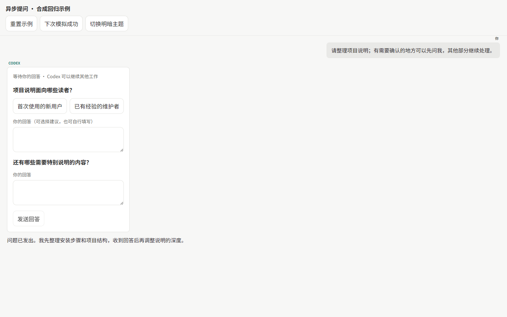
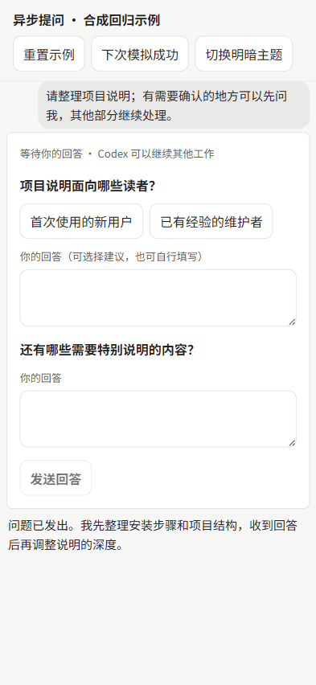

# 异步提问（实验性，可选开启）

CX-Codex 已支持 `item/tool/requestUserInput`：运行时等待用户回答后继续。本功能增加另一种交互：Codex 发出问题后立即继续独立工作，用户稍后选择建议或填写文字，再将回答发送到同一个任务。

## 开启与使用

当前验证版本为 Codex CLI **0.153.4**。该功能使用公开但仍属实验性的 App Server `dynamicTools` 协议；默认关闭，旧版 CLI 的默认启动参数保持不变。

启动 CX-Codex 的进程环境中设置 `CX_CODEX_ASYNC_QUESTIONS=1`，然后新建任务。例如 PowerShell：

```powershell
$env:CX_CODEX_ASYNC_QUESTIONS = '1'
cx-codex
```

Linux/macOS：

```sh
CX_CODEX_ASYNC_QUESTIONS=1 cx-codex
```

使用服务管理器时，应在该服务的进程环境中设置并重启服务。仅在终端中设置变量不会改变已经运行的服务。

新任务会获得 `cx_ask_user_async` 工具。可以要求 Codex：“需要确认的地方先向我提问，其余部分继续处理。”每次可提出 1–3 个问题，每题可提供最多 8 个建议；始终允许自由填写，建议不会自动提交。全部填写后点击“发送回答”。

问题提交后，工具返回的是“等待用户回答”，不是用户答案或权限批准。回答通过现有消息通道发送：活动任务使用 steer，已结束的任务按原有发送流程继续。确认前显示发送状态，失败后在原有失败消息或队列中重试、编辑。刷新后从任务历史恢复问题和回答。

## 范围与边界

- 只在 CX-Codex 新建任务时注册工具；已经存在的任务不会自动增加工具。已注册工具的持久任务由 App Server 在恢复时重新加载。
- 未开启时不注册、不接收这个工具。历史中的问题仍可显示，用户仍可通过正常消息回答。
- 命令审批、文件审批、同步 `requestUserInput` 与其他未知动态工具的策略保持原样。
- 不新增数据库、常驻进程、桌面私有接口或自动审批。问题状态来自成功完成的工具历史；回答状态来自现有消息和 outbox。
- 回答表单会阻止当前页面内的重复提交。多个客户端同时回答仍遵循上游普通消息语义，不宣称跨客户端“恰好一次”。
- 只展示当前已加载历史中的问题；本次没有新增全局问题收件箱或后台通知。
- 长时间没有收到回答不能解释为同意。必须等待许可的操作仍需等待明确许可。

每题标题最多 2,000 字符，每个建议最多 500 字符，每题回答最多 8,000 字符。空白、超量或重复建议会被拒绝。

## 协议与验证

参考：[OpenAI App Server 文档](https://developers.openai.com/codex/app-server)。本功能不调用 Codex 桌面私有 RPC。

涉及 `initialize.capabilities.experimentalApi`、`thread/start.dynamicTools`、`item/tool/call`、`item/completed` 中的 `dynamicToolCall`、`thread/read`，以及现有 `turn/steer` / `turn/start`。工具立即返回 `success` 与 `contentItems`；后续回答作为带有工具调用 ID 的普通用户消息发送。显示层将回答转换为可读文字，保留原始消息用于身份匹配和恢复。

```sh
npm run verify:async-questions
npm run verify:server-modules
npm run verify:frontend-normalizers
npm run build
```

`npm run preview:async-questions` 在 `127.0.0.1:17520` 打开合成回归页面，使用真实 `ThreadConversation` 和 normalizer，不启动 App Server，也不调用模型。可测试选择、文本、确认中、失败、重试与明暗主题；退出进程即关闭预览。截图保存在忽略的 `output/` 中。

2026-09-18，真实 CLI 0.153.4 已完成 initialize → 注册工具 → 模型调用 → 立即回复 → 活动 turn 的 steer 回答 → thread/read 恢复问题和回答，合成任务随后归档。浏览器检查覆盖五种视口的待回答布局、桌面/手机已回答状态、手机深色和发送中；控制台无错误。

补验已通过：合成发送失败后保留全部答案，点击原失败消息的“重试”后显示“已回答”，没有新增重复回答；Chrome 原生键盘事件（CDP）确认文本框内 Enter 只换行，焦点位于“发送回答”按钮时 Enter 仅提交一次。测试使用完整虚拟键码及字符参数，不以工具返回“按键成功”代替实际页面结果。失败与重试在合成夹具中模拟，不代表真实网络断开恢复已经端到端覆盖；也未替代 Windows 物理键盘、Android 真机、其他 CLI 版本或整个产品的发布验收。

### 合成页面截图

以下仅包含公开的合成示例，没有真实任务内容。





常规 schema audit 返回 1，表示 CLI 0.153.4 与仓库旧基线存在差异，生成过程成功；本次仅核验以上相关协议。额外使用 `codex app-server generate-ts --experimental` 复核 `DynamicToolSpec`、调用参数/结果及 `ThreadItem`，没有整体替换历史 schema 基线。

回滚：停止进程、取消 `CX_CODEX_ASYNC_QUESTIONS`、重新启动。需要移除界面时一起回退本功能提交；既有历史数据不删除。
