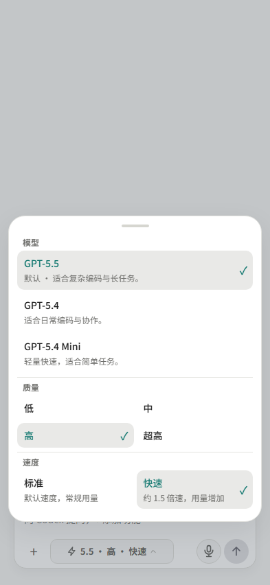

# CX-Codex 2.3.0：手机端会话与远程连接体验升级

Self-hosted OpenAI Codex Web UI and Android client bridge.

这一版把重点放在“手机上持续使用 Codex 是否足够顺手、稳定、可读”。会话内容更干净，流式输出更跟手，模型和插件入口也不再依赖前端写死的列表。




## 适合谁升级

- 经常从手机、折叠屏或平板继续查看和发送 Codex 任务的人。
- 想把本机 Codex 通过局域网、VPN、Tunnel 或反向代理稳定访问的人。
- 需要在不暴露私人会话、路径或凭据前提下维护自托管入口的人。

## 本次版本重点

- 手机端会话释放可读宽度，压缩标题噪音；内部上下文、插件推荐、记忆引用和应用指令不再混入普通聊天内容。
- 真实流式输出优先首字落屏，持续增量采用有界合批；避免重复消息、无效 Markdown 重算和滚动抖动，完整回复结束后再进行 Markdown 渲染。
- 模型与推理档位由运行时 `model/list` 能力决定。服务端以后开放新模型时会自动出现，不会在界面中伪造尚未可用的型号。
- `+` 菜单保留附件、拍照、仅生成计划、本轮要求、插件和启用技能。已安装原生插件优先出现，较慢的 MCP 信息在后台补齐。
- 通知 replay、WS/SSE 背压和连接心跳继续收口，降低弱网手机、慢连接和长会话下的状态错误与服务端内存风险。

## 升级方式

Windows 一条命令安装或更新：

```powershell
Set-ExecutionPolicy Bypass -Scope Process -Force; irm https://raw.githubusercontent.com/Qjzn/CX-Codex/main/scripts/bootstrap-windows.ps1 | iex
```

源码部署：

```powershell
git pull
npm ci
npm run build
node dist-cli/index.js
```

## 升级后建议验证

1. 用手机打开一个已有长会话，确认标题栏和正文没有横向溢出。
2. 打开模型设置，确认列表只显示当前服务端实际开放的模型和推理档位。
3. 打开 `+` 菜单，确认附件、计划、本轮要求、插件和技能入口可用；原生插件应先出现，MCP 能力随后补齐。
4. 让 Codex 生成一段较长回复，确认首字快速出现、持续输出顺滑，手动上滑后不会被自动滚动抢走阅读位置。

## 仍需注意

- CX-Codex 是本机 Codex App Server 的 Web / Android bridge，不是独立云端 Codex 服务。
- App Server 协议兼容仍以仓库 schema drift 记录为准；不要把实验、只读诊断或受功能开关控制的能力宣传为全面可用。
- 公网访问必须启用密码、VPN、Tunnel、反向代理鉴权或其他受控边界。
- Release 的截图均使用脱敏演示数据；不要把真实账号、路径、密钥、地址或私人会话提交到仓库。
