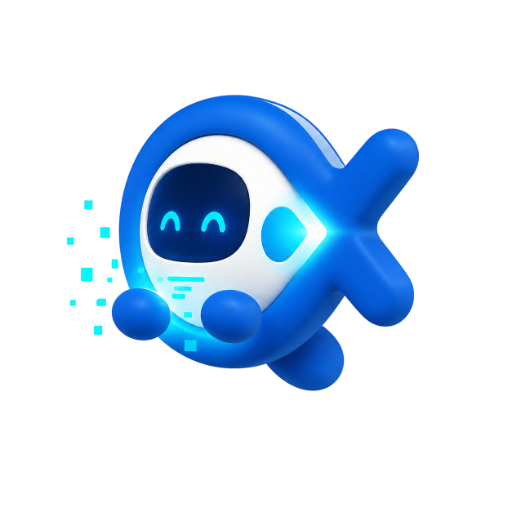

# CX-Codex 2.4.0：会工作的 CX 电子宠物浮窗

这一版把 Android 浮窗从一个任务入口升级为真正可日常使用的工作进度助手：不离开当前应用，就能看到 Codex 最新回复、进入指定会话，或直接回复继续处理。

## 本次版本重点

- **CX 品牌动态宠物**：待命、处理中、等待操作、完成和拖拽使用不同形象；完整宠物支持动态素材，待命时自动缩成不打扰操作的 48dp 气泡。
- **真正有信息量的进展**：任务卡优先显示最新 Codex 回复摘要，会话名、项目和阶段降为辅助信息，不再要求用户点进去才知道做到哪里。
- **准确进入指定会话**：点击任务或最近两条会话，会直接打开对应聊天页面；冷启动和后台唤醒也会等 Android Activity 稳定后再导航。
- **浮窗直接回复**：长按最近会话，或点击任务回复入口，即可在浮窗中输入和发送，不必先切回平台。
- **读后再清理**：完成记录会一直保留，直到目标会话真正打开、内容加载且任务确认结束，避免用户错过结果。
- **拖拽和关闭更安全**：拖拽跟手、松手贴边并提供触感反馈；关闭浮窗需要二次确认，之后可在设置中重新开启。

## 消息不会再轻易“发丢”

2.4.0 同时重做了移动端消息确认链路：

- 点击发送后立即显示本地消息和运行反馈，不再等待网络返回才有反应。
- 网络不稳定时显示有界的重连/确认进度；明确失败后保留原消息，可原位重试或重新编辑。
- 页面刷新、WebView 重建或应用回到前台后，会使用持久消息标识查询服务端，不会因为响应丢失而重复发送同一内容。
- 新会话第一条消息也使用同一套可靠链路，真实会话创建后立即进入页面，发送确认在后台继续完成。

## 解决“执行十小时但早已没有输出”

- 服务端持续对账启动不确定、同步降级和重启遗留请求。
- Android 和 Web 只接受不早于当前状态的运行快照，旧轮询结果不能把已完成任务重新改成运行中。
- 断网、部分数据或无法确认的状态显示为“等待同步/状态待确认”，不会继续累加一个没有依据的运行时长。
- 完成、停止和失败事件即使通过重放恢复，也会清理本地残留的运行卡、计时器和待确认状态。

## 如何使用电子宠物浮窗

1. 安装 `CX-Codex 2.4.0` Android APK。
2. 在 CX-Codex 设置中开启“系统悬浮窗”。
3. 按系统提示授予“显示在其他应用上层”和通知权限。
4. 待命时点击小气泡可展开面板；有任务时会自动显示完整宠物和最新进展。
5. 点击任务进入对应会话；长按最近会话可直接回复；拖动宠物可移动到屏幕另一侧。

## 升级注意事项

- 系统浮窗和直接回复包含 Android 原生代码，旧 APK 不能通过网页热更新获得，需要安装本版本 APK。
- Android 必须保留一条低打扰前台通知来维持跨应用浮窗。若手机系统实行严格后台省电，建议允许 CX-Codex 后台运行。
- 未授予系统浮窗权限时，Web 平台仍可正常使用，不会影响普通会话功能。

## 验证范围

- 前端生产构建、CLI 构建、服务端模块和前端状态归一化验证通过。
- Android Java 编译、任务状态策略单测和 release APK 构建通过。
- 手机尺寸回归覆盖宠物展开/收起、任务摘要、最近会话、指定会话跳转和浮窗直接回复。
- 发送重试、持久发件箱、运行序号单调收敛、终态重放清理和服务重启对账均有自动化回归覆盖。
